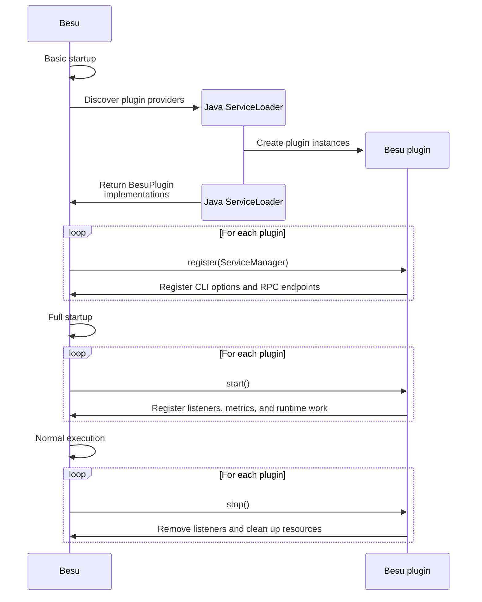

# Plugin lifecycle

Besu plugins implement `BesuPlugin`.
Besu discovers plugin JARs with Java `ServiceLoader`, then calls the plugin lifecycle methods during startup, runtime, reload, and shutdown.

## Lifecycle methods

| Method | Purpose |
| --- | --- |
| `getName()` | Returns the plugin name. Besu uses this name for plugin-specific actions. The default is the plugin class name. |
| `register(ServiceManager)` | Called early in the Besu lifecycle. Store the `ServiceManager` and perform early registration such as CLI options and RPC endpoints. |
| `beforeExternalServices()` | Optional hook called after Besu loads configuration and before external services, such as metrics and HTTP, start. |
| `start()` | Called after Besu loads configuration and starts external services, but before the main loop is up. Start runtime work here. |
| `afterExternalServicePostMainLoop()` | Optional hook called after external services and post-main-loop setup. |
| `reloadConfiguration()` | Optional hook called by the plugin reload JSON-RPC method. Implement it only for configuration that can be reloaded safely. |
| `stop()` | Called when Besu shuts down or disables the plugin. Remove listeners and stop background work here. |
| `getVersion()` | Returns plugin version information from package implementation metadata. |

## Startup and shutdown flow

The following sequence shows where plugin discovery and lifecycle callbacks fit into Besu startup,
normal execution, and shutdown.

## Use the `ServiceManager`

`register(ServiceManager)` is the only lifecycle method that receives the `ServiceManager`. Store it
in a field if the plugin needs to access services in later lifecycle methods.

Retrieve services with `getService(...)` and handle missing services. A service might be unavailable
because it has not started yet, the Besu version does not support it, or the current Besu
configuration does not provide it.

## Service availability

The following services have explicit timing requirements:

| Service or action | Lifecycle timing |
| --- | --- |
| `PicoCLIOptions` | Available during `register()`. Register plugin CLI options there. |
| `RpcEndpointService` | Available during `register()` and must be used during `register()`. RPC handlers are not called before `start()`. |
| Most services | Might not be available before `start()`. Retrieve them as `Optional` and handle absence. |
| Event listeners | Register in `start()` and remove in `stop()`. |
| Background threads | Start in `start()` and stop in `stop()`. |

If a plugin needs a service during startup, check whether the service is present and fail only when
the user explicitly requested functionality that cannot work without it.
