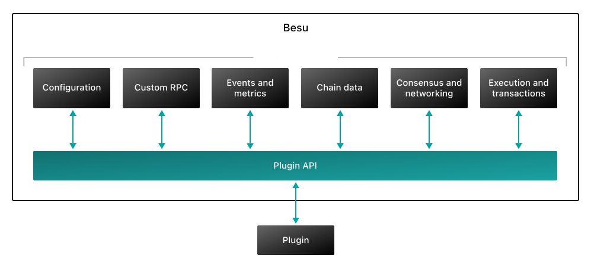

# Besu plugins

Besu plugins are Java extensions that use the [Plugin API](reference/plugin-api/index.md) to
extend Besu functionality without modifying Besu source code.

You can create your own plugin to build app-specific chains, integrate Besu with enterprise systems,
observe blockchain activity, analyze transactions, support Layer 2 networks, or add debugging and
operational tooling.

Plugins use Besu services to query, configure, extend, or replace parts of Besu.
They can also register event listeners to observe Besu activity such as block imports, transaction
pool changes, logs, and sync status changes.

Get started with the [quickstart](get-started/quickstart.md), or explore the
[plugin lifecycle](get-started/plugin-lifecycle.md) and [plugin features](/plugins/features).

## Architecture

The following diagram illustrates some of the interfaces exposed by the Plugin API.

If you have questions about creating or using Besu plugins, ask on the **besu** channel on
[Discord](https://discord.gg/hyperledger).
