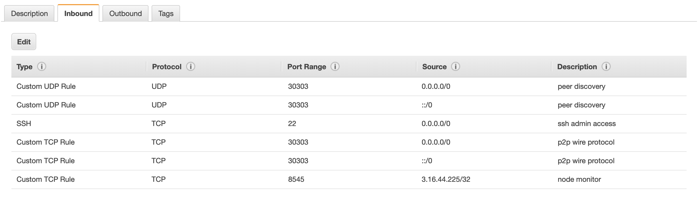

import Tabs from '@theme/Tabs';
import TabItem from '@theme/TabItem';

# Configure ports

To enable communication you must expose Besu ports appropriately. The following shows an example port configuration for a Besu node on AWS. 



When running Besu from the [Docker image](../../get-started/install/run-docker-image.md), [expose ports](../../get-started/install/run-docker-image.md#expose-ports).

:::info

If your nodes are running in AWS, ensure you have appropriate `SecurityGroups` to allow access to the required ports.

:::

:::tip

Besu supports [UPnP](specify-nat.md) for home or small office environments where a wireless router or modem provides NAT isolation.

:::

## P2P networking

To enable peer discovery, the P2P UDP port must be open for inbound connections.
By default, that UDP port is the same as the TCP P2P port set with
[`--p2p-port`](../../reference/options.md#p2p-port) (and
[`--p2p-port-ipv6`](../../reference/options.md#p2p-port-ipv6) for
[dual-stack](../../concepts/ipv6-dual-stack.md)).

To bind discovery on a different UDP port, set
[`--p2p-discovery-port`](../../reference/options.md#p2p-discovery-port) (and
[`--p2p-discovery-port-ipv6`](../../reference/options.md#p2p-discovery-port-ipv6) for dual-stack).
This is useful when the host maps TCP and UDP separately, for example, in Kubernetes.

When the TCP and UDP ports differ, the advertised
[enode URL](../../concepts/node-keys.md#enode-url) includes `?discport=<udp-port>`.
For example:

<Tabs>
<TabItem value="Command line" default>

```bash
besu --p2p-port=30303 --p2p-discovery-port=30301
```

</TabItem>
<TabItem value="Enode URL">

```text
enode://<id>@<host>:30303?discport=30301
```

</TabItem>
</Tabs>

Options that end in `ipv6` configure [dual-stack networking](../../concepts/ipv6-dual-stack.md).

We also recommend opening the P2P TCP port for inbound connections. This is not strictly required because Besu attempts to open outbound TCP connections. But if no nodes on the network are accepting inbound TCP connections, nodes cannot communicate.

To specify the P2P host, set [`--p2p-host`](../../reference/options.md#p2p-host)
(and [`--p2p-host-ipv6`](../../reference/options.md#p2p-host-ipv6) for dual-stack).

By default, peer discovery listens on all available network interfaces.
If the device Besu is running on must bind to a specific network interface, specify the interface using [`--p2p-interface`](../../reference/options.md#p2p-interface)
(and [`--p2p-interface-ipv6`](../../reference/options.md#p2p-interface-ipv6) for dual-stack).

## JSON-RPC API

To enable access to the [JSON-RPC API](../use-besu-api/json-rpc.md), open the HTTP JSON-RPC and WebSockets JSON-RPC ports to the intended users of the JSON-RPC API on TCP.

Specify the HTTP and WebSockets JSON-RPC ports using the [`--rpc-http-port`](../../reference/options.md#rpc-http-port) and [`--rpc-ws-port`](../../reference/options.md#rpc-ws-port) options. The defaults are `8545` and `8546`.

## Metrics

To enable [Prometheus to access Besu](../monitor/metrics.md), open the metrics port or metrics push port to Prometheus or the Prometheus push gateway on TCP.

Specify the ports for Prometheus and Prometheus push gateway using the [`--metrics-port`](../../reference/options.md#metrics-port) and [`--metrics-push-port`](../../reference/options.md#metrics-push-port) options. The defaults are `9545` and `9001`.
