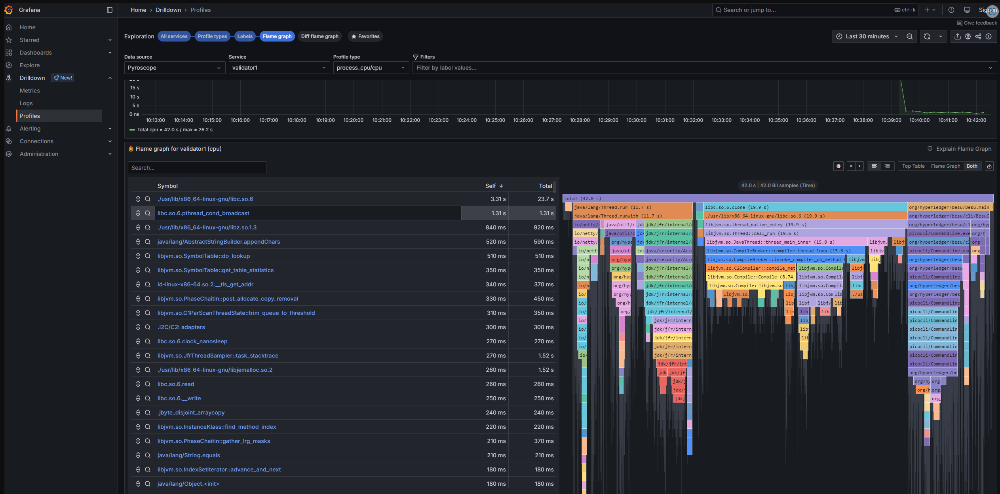

import Tabs from '@theme/Tabs';
import TabItem from '@theme/TabItem';

# Profile Besu with Pyroscope

[Grafana Pyroscope](https://grafana.com/docs/pyroscope/latest/) continuously profiles a running node and shows which code paths consume CPU, memory, and lock time. Use Pyroscope when [metrics](metrics.md) tell you a node is under load but not which part of Besu is responsible.

The Besu Docker image bundles the [Pyroscope Java agent](https://grafana.com/docs/pyroscope/latest/configure-client/language-sdks/java/) and a default agent configuration file. The agent is inactive until you attach it.

:::note

The Docker image bundles the agent from Besu 25.6.0 onwards. The binary distribution doesn't include it, so use [Java Flight Recorder](java-flight-recorder.md) to profile a node installed from the binary distribution.

:::

## Prerequisites

- A [Pyroscope server](https://grafana.com/docs/pyroscope/latest/get-started/) your Besu container can reach.
- A Grafana instance with a [Pyroscope data source](https://grafana.com/docs/grafana/latest/datasources/grafana-pyroscope/) to view the profiles.

## Enable the agent

Attach the bundled agent using [`BESU_OPTS`](../configure-java/pass-jvm-options.md), and set `PYROSCOPE_SERVER_ADDRESS` to the address of your Pyroscope server:

<Tabs>
<TabItem value="Docker">

```bash
docker run -p 8545:8545 -p 30303:30303 \
  -e BESU_OPTS=-javaagent:/opt/besu/pyroscope/pyroscope.jar \
  -e PYROSCOPE_SERVER_ADDRESS=http://<PYROSCOPE_HOST>:4040 \
  -e PYROSCOPE_APPLICATION_NAME=<NODE_NAME> \
  hyperledger/besu:latest --network=sepolia
```

</TabItem>
<TabItem value="Docker Compose">

```yaml
services:
  besu:
    image: hyperledger/besu:latest
    command: --network=sepolia
    environment:
      BESU_OPTS: -javaagent:/opt/besu/pyroscope/pyroscope.jar
      PYROSCOPE_SERVER_ADDRESS: http://pyroscope:4040
      PYROSCOPE_APPLICATION_NAME: <NODE_NAME>
    ports:
      - 8545:8545
      - 30303:30303
```

</TabItem>
</Tabs>

`PYROSCOPE_APPLICATION_NAME` is the name the node appears under in Grafana. Set a distinct value for each node so you can tell profiles apart.

:::tip

If you run Pyroscope in the same Docker network under the hostname `pyroscope`, on the default port `4040`, you can omit `PYROSCOPE_SERVER_ADDRESS`. That address is already the default in the bundled configuration.

:::

## View profiles in Grafana

Select the Pyroscope data source in Grafana, then select your node under **Service** and a profile type such as `process_cpu:cpu`. The flame graph shows the call stacks that consumed the most CPU over the selected time range, and the table lists the same data by symbol.



The root frame sits at the top of the flame graph, and each row below it shows the functions that frame called. A bar's width is the proportion of samples in which that function was on the stack, so wide bars deep in the graph are the hotspots worth investigating.

## Change the agent configuration

The image sets `PYROSCOPE_CONFIGURATION_FILE` to `/etc/besu/pyroscope.properties`, which contains the following defaults:

| Property                       | Environment variable           | Default                 |
| ------------------------------ | ------------------------------ | ----------------------- |
| `pyroscope.server.address`     | `PYROSCOPE_SERVER_ADDRESS`     | `http://pyroscope:4040` |
| `pyroscope.application.name`   | `PYROSCOPE_APPLICATION_NAME`   | `besu`                  |
| `pyroscope.format`             | `PYROSCOPE_FORMAT`             | `jfr`                   |
| `pyroscope.profiling.event`    | `PYROSCOPE_PROFILING_EVENT`    | `itimer`                |
| `pyroscope.profiling.interval` | `PYROSCOPE_PROFILING_INTERVAL` | `10ms`                  |
| `pyroscope.profiling.alloc`    | `PYROSCOPE_PROFILING_ALLOC`    | `512k`                  |
| `pyroscope.profiling.lock`     | `PYROSCOPE_PROFILING_LOCK`     | `10ms`                  |
| `pyroscope.upload.interval`    | `PYROSCOPE_UPLOAD_INTERVAL`    | `15s`                   |
| `pyroscope.log.level`          | `PYROSCOPE_LOG_LEVEL`          | `debug`                 |

Override any property with the matching environment variable, which is the property name in uppercase with underscores instead of dots. For example, `pyroscope.upload.interval` becomes `PYROSCOPE_UPLOAD_INTERVAL`.

The bundled configuration sets the agent log level to `debug`. Set `PYROSCOPE_LOG_LEVEL=info` to reduce how much the agent logs.

To replace the configuration wholesale, mount your own properties file over `/etc/besu/pyroscope.properties`, or point `PYROSCOPE_CONFIGURATION_FILE` at a different path. Don't use quotes in the properties file.

For the full set of agent options, including authentication for hosted Pyroscope, see the [Pyroscope Java SDK documentation](https://grafana.com/docs/pyroscope/latest/configure-client/language-sdks/java/).
